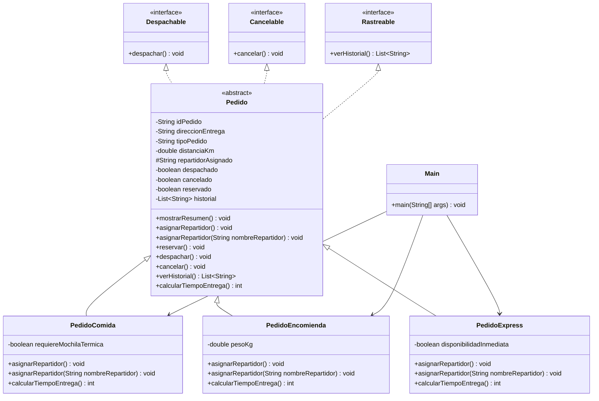

# SpeedFast

Proyecto académico desarrollado para la asignatura **Desarrollo Orientado a Objetos II**.

El proyecto representa un sistema de reparto para la empresa SpeedFast, aplicando conceptos de Programación Orientada a Objetos mediante herencia, polimorfismo, clases abstractas e interfaces.

---

## Semana 1 - Polimorfismo

Durante esta semana se implementó un sistema de gestión de pedidos para la empresa SpeedFast aplicando conceptos de Programación Orientada a Objetos.

### Funcionalidades implementadas

- Clase base `Pedido`.
- Subclase `PedidoComida`.
- Subclase `PedidoEncomienda`.
- Subclase `PedidoExpress`.
- Herencia.
- Sobrescritura de métodos.
- Sobrecarga de métodos.
- Polimorfismo.
- Asignación automática y manual de repartidores.

---

## Semana 2 - Clases Abstractas

Durante esta semana se amplió el sistema SpeedFast incorporando abstracción y cálculo de tiempos de entrega.

### Funcionalidades implementadas

- Clase abstracta `Pedido`.
- Atributo `distanciaKm`.
- Método `mostrarResumen()`.
- Método abstracto `calcularTiempoEntrega()`.
- Cálculo personalizado para `PedidoComida`.
- Cálculo personalizado para `PedidoEncomienda`.
- Cálculo personalizado para `PedidoExpress`.

### Tiempos de entrega

- `PedidoComida`: 15 minutos base + 2 minutos por kilómetro.
- `PedidoEncomienda`: 20 minutos base + 1.5 minutos por kilómetro.
- `PedidoExpress`: 10 minutos base y 5 minutos adicionales cuando la distancia supera los 5 km.

---

## Semana 3 - Interfaces y gestión integral de pedidos

Durante esta semana se completó el sistema SpeedFast integrando abstracción, polimorfismo e interfaces.

### Funcionalidades implementadas

- Interfaces `Despachable`, `Cancelable` y `Rastreable`.
- Asignación automática de repartidores.
- Asignación manual mediante sobrecarga.
- Cálculo de tiempos de entrega según tipo de pedido.
- Reserva de pedidos.
- Despacho de pedidos.
- Cancelación de pedidos.
- Historial de operaciones mediante `ArrayList`.
- Uso de polimorfismo y sobrescritura.
- Simulación integral desde la clase `Main`.

---

## Tecnologías utilizadas

- Java
- IntelliJ IDEA
- Git
- GitHub

---

## Diagrama de clases

---

## Explicación del diseño

Este sistema fue diseñado aplicando principios de Programación Orientada a Objetos para favorecer la **escalabilidad, reutilización y mantenibilidad** del software.

- **Escalabilidad:** la clase abstracta `Pedido` permite incorporar nuevos tipos de pedidos en el futuro sin modificar la estructura principal del sistema.
- **Reutilización:** los atributos y métodos comunes se encuentran definidos en `Pedido`, evitando repetir código en `PedidoComida`, `PedidoEncomienda` y `PedidoExpress`.
- **Mantenibilidad:** las interfaces `Despachable`, `Cancelable` y `Rastreable` permiten separar las diferentes responsabilidades del sistema.
- **Polimorfismo:** cada tipo de pedido implementa su propio comportamiento para la asignación del repartidor y el cálculo del tiempo de entrega.
- **Abstracción:** la clase `Pedido` establece las características comunes y obliga a las subclases a implementar `calcularTiempoEntrega()`.
- **Organización:** la clase `Main` permite realizar una simulación integral del funcionamiento del sistema mediante asignación, reserva, despacho, cancelación e historial.